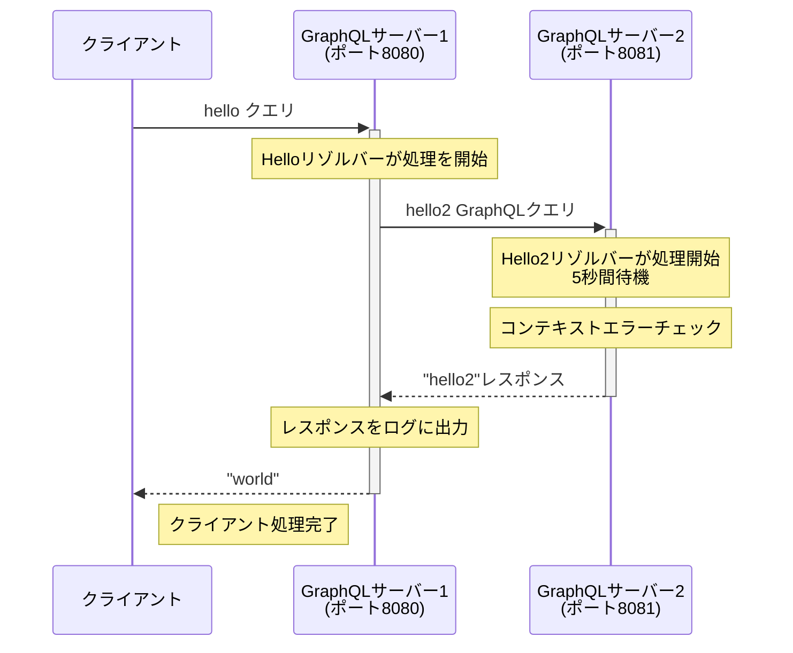

# gqlgenctx

gqlgenを使用したctxのエラーの伝播を検証するためのリポジトリです。

## シーケンス図

以下はこのプロジェクトの動作フローを示すシーケンス図です：



## セットアップと実行

このプロジェクトではMakefileを使って各種操作を行います。

### 実行

```bash
# コード生成
make gen

# GraphQLサーバーを実行
make run-server
make run-server2

# クライアントを実行（サーバーが起動していることが前提）
make run-client
```


## サーバー情報

### GraphQLサーバー

GraphQLサーバーが起動したら、ブラウザで http://localhost:8080 と http://localhost:8081 にアクセスして、GraphQLプレイグラウンドを使用できます。

#### サンプルクエリ

```graphql
query {
  hello
}
```